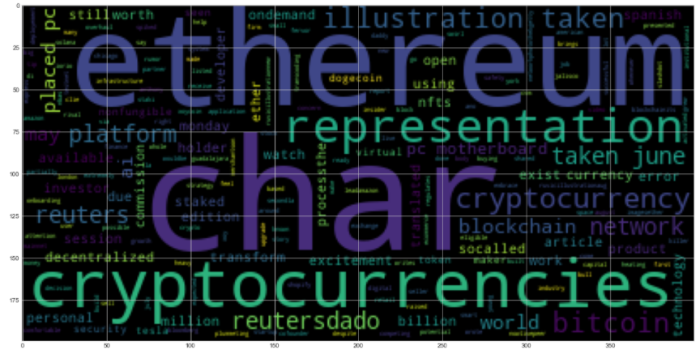
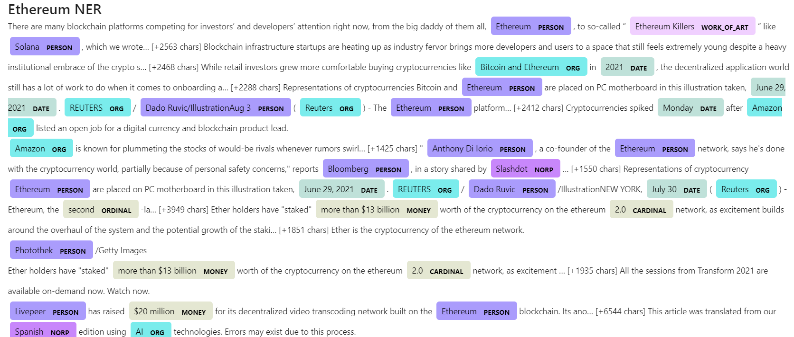

# NLP (Natural Processing Language)
# Tales from the Crypto

## Background

There's been a lot of hype in the news lately about cryptocurrency, so I wanted to take stock, so to speak, of the latest news headlines regarding Bitcoin and Ethereum to get a better feel for the current public sentiment around each coin.

In this tool, I have applied natural language processing to understand the sentiment in the latest news articles featuring Bitcoin and Ethereum. I have also applied fundamental NLP techniques to better understand the other factors involved with the coin prices such as common words and phrases and organizations and entities mentioned in the articles.

The tool performs the following tasks:

1. [Sentiment Analysis](#1---Sentiment-Analysis)
2. [Natural Language Processing](#2---Natural-Language-Processing)
3. [Named Entity Recognition](#3---Named-Entity-Recognition)

---

## Files

[Starter Notebook](crypto_sentiment.ipynb)

---

### 1 - Sentiment Analysis

Using the [newsapi](https://newsapi.org/) I pulled the latest news articles for Bitcoin and Ethereum and create a DataFrame of sentiment scores for each coin.

Using descriptive statistics the following questions were analysed:

> Which coin had the highest mean positive score?
>
> Which coin had the highest negative score?
>
> Which coin had the highest positive score?

### 2 - Natural Language Processing

I used NLTK and Python to tokenize text, find n-gram counts, and create word clouds for both coins. 

#### Tokenize

Be sure to:

1. Lowercased each word.
2. Removed punctuation.
3. Removed stop words.

#### N-grams

Next,  ngrams and word frequency for each coin were analysed.

1. Use NLTK to produce the ngrams for N = 2.
2. List the top 10 words for each coin.

#### Word Clouds

Finally, word clouds were generated for each coin to summarize the news for each coin.

### 3 - Named Entity Recognition

In this section, I built a named entity recognition model for both coins and visualized the tags using SpaCy.

### Resources

[Vader Sentiment Analysis](http://www.nltk.org/howto/sentiment.html)
